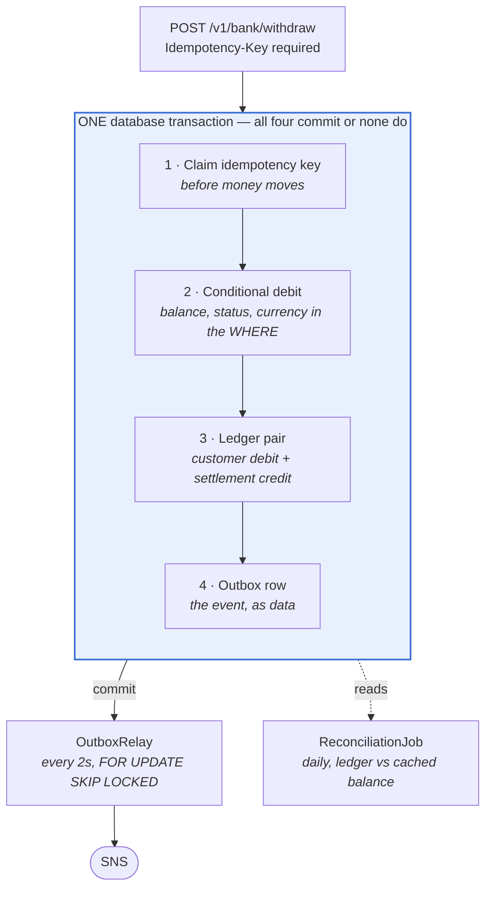

# Withdrawal service — approach and implementation choices

Submission for the bank account withdrawal code improvement exercise.

The brief asks for four things: an outline of the approach with the business capability
preserved, elaboration on implementation choices, the fixed code, and notes on any unclear
library usage. This document is organised in that order. The code is in this repository;
`git log` is the narrative — each commit states what was wrong and why the fix is that fix.

---

## 1. Approach

### How I read the task

The snippet is short, but almost every line of it is load-bearing on something the brief
names. I worked in this order, which is also my order of priority:

1. **Correctness first.** A withdrawal endpoint that can produce a wrong balance is not
   improved by anything else on the list. This is where the race condition, the unreachable
   publish and the money arithmetic live.
2. **Then the guarantees around it** — what happens on a retry, a crash between two writes,
   a broker outage. Fault tolerance and auditability in the brief's terms.
3. **Then the controls that prove it worked** — a ledger nobody checks is decoration, so
   the reconciliation exists to make the ledger mean something.
4. **Then operability** — status codes a caller can branch on, logs that can be correlated,
   metrics with a latency distribution rather than an average.

I stopped at the boundary of what this service can own. What I did not build is in §6, and
I would rather be asked why something is missing than explain machinery I could not justify.

### Scope

The estimate was 1.5–2.5 hours. The code commits span 2h12m and the write-up followed
the next day. The shape of the
solution reflects that budget being spent on depth in one place rather than breadth
everywhere: the concurrency and delivery guarantees are worked through properly and
verified against a real database, while whole categories the brief puts out of scope
— security in particular — are untouched and flagged rather than half-built.

Two deliberate departures from the brief's "out of scope" list, both because the thing
being tested cannot be demonstrated any other way:

- **The code compiles and runs.** The brief says it needn't. But the central claim is about
  PostgreSQL's behaviour when a conditional `UPDATE` meets a concurrently locked row, and
  that claim is either true against a real database or it is an assertion. It is worth more
  as a thing you can run than as a paragraph.
- **There are tests.** The brief says they may be omitted. The concurrency ones exist
  because "no lost updates" is a claim that needs executing rather than stating; each is
  written so it fails if the mechanism it covers is removed, and I checked that by removing
  them. The rest followed once the harness existed.

---

## 2. What the original does, and what is wrong with it

Preserving the business capability means being precise about what it currently is.

**Intended capability:** debit an account by an amount if the balance covers it, and emit a
withdrawal event. That is preserved exactly — same operation, same two effects.

**As written, the second half does not happen.** Every branch of the `if/else` returns
before the SNS block is reached, so the publish is unreachable code and no event is ever
emitted. The first thing the rewrite does is make the stated capability actually occur.

| # | Defect | Consequence |
|---|---|---|
| 1 | `SELECT balance`, compare in Java, then `UPDATE` | Check-then-act race. Two concurrent withdrawals of 60 against a balance of 100 both pass the check and both debit, leaving −20.00. Reproduced against PostgreSQL 16. |
| 2 | The SNS publish sits after `return` on every path | Unreachable. The event is never published, so the business capability is half-implemented. |
| 3 | `String.format` JSON in `toJson()` | Produces invalid JSON for any value containing a quote or backslash, and renders `BigDecimal` as a quoted string so consumers parse a number as text. |
| 4 | `SnsClient` built in the controller constructor, `Region.YOUR_REGION`, hardcoded ARN | Untestable, unshareable, never closed, and ties a web component to a transport concern. |
| 5 | Every outcome returns HTTP 200 with a prose string | A caller cannot branch on the result. "Insufficient funds" and "successful" are both 200. |
| 6 | No transaction anywhere | The balance write and the event have no atomicity relationship. |
| 7 | `JdbcTemplate` is used but never imported | It does not compile as given. Noted because the brief says it needn't — but it is worth saying which defects are design and which are the snippet being a sketch. |

---

## 3. Implementation choices

Everything below is one transaction or deliberately outside it. That line is the design:



The original published to SNS as a second, independent write after the balance update.
Die between them and the money moved with no event; publish then roll back and an event
exists for money that never moved. Writing the event as a row **inside** the transaction
removes that window by construction. The relay turns rows into messages afterwards, which
makes delivery at-least-once — consumers must be idempotent, as they must be under any
real broker.

### The core fix

```sql
UPDATE accounts
   SET balance = balance - :amount
 WHERE id = :accountId
   AND is_system = FALSE
   AND status = 'ACTIVE'
   AND currency = :currency
   AND balance >= :amount
RETURNING balance
```

The check and the write are one statement, so the row lock and the predicate are the same
operation. A blocked second caller re-reads the committed row and re-evaluates this `WHERE`
against it — it either still qualifies or matches zero rows.

That behaviour **requires** READ COMMITTED, which is why it's pinned at the pool rather than
assumed. REPEATABLE READ and above can't re-read without breaking their own snapshot, so
they raise a serialization failure instead, turning an ordinary insufficient-funds result
into an error the application has to retry.

Zero rows has four causes. `diagnose()` runs only on that path and separates them.

### The rest, in brief

| Decision | Why | Cost / alternative |
|---|---|---|
| **Idempotency key required, not optional** | Optional idempotency on a money endpoint guarantees someone double-debits on a timeout retry | A caller must generate one |
| **`ON CONFLICT ... DO UPDATE`**, not catching a duplicate key | In PostgreSQL any error aborts the transaction — a caught violation leaves it unusable for the replay read that follows | `DO NOTHING` is simpler but can't express the TTL re-claim |
| **TTL enforced at claim time** | Expiry is a property of the row, so it must be evaluated when the row is claimed. Leaving it to the nightly purge kept keys effective up to 24h past expiry | — |
| **Retry boundary outside the transaction** | Spring marks a transaction rollback-only on first exception, so retrying inside it can never succeed | One extra bean; a self-invocation would silently bypass the proxy |
| **Business outcomes excluded from retry** | Insufficient funds is a correct answer, not a failure — and a retry could succeed later after an unrelated deposit | — |
| **`lock_timeout = 3s`** on every connection | Without it one long transaction backs requests up until the pool drains and callers see connection timeouts instead of a status code | A legitimately slow transaction can be killed |
| **Double-entry with a `transaction_id`** | Lets any *individual* movement be proven to balance; a global sum wouldn't catch two errors cancelling out | Two rows per withdrawal |
| **Reconciliation is one daily full sweep** | A cached balance and a ledger are two representations of one fact, so something must prove they agree. Re-deriving everything is fifteen lines with no concurrency semantics to get wrong | An incremental, watermark-bounded pass is the obvious optimisation and is deliberately absent — §6 |
| **Append-only enforced by triggers** | Application-level immutability is a convention; this is an invariant. Statement-level for TRUNCATE, because row triggers don't fire on it | Corrections need contra entries, not edits |
| **Failure classified, not counted** | An attempt counter can't tell a malformed message from a broker outage. The previous version dead-lettered everything after ~8.5 minutes of downtime | Publishers must own the taxonomy |
| **No attempt limit on transient failures** | An undeliverable AML-relevant event is an alert, not a discard | An unbounded backlog needs an operator |
| **RFC 7807, distinct `type` per account status** | One status code, three different next steps — dormant needs reactivating, frozen needs the hold lifted, closed is terminal | — |
| **Sealed exceptions, exhaustive switch** | A new subtype breaks the build until someone picks its status code. This fired for real when `CurrencyMismatchException` was added | — |
| **`NUMERIC(19,2)` + `@Digits` at the boundary** | See below | — |

### Money

The amount constraints are the only thing between a sub-cent request and a phantom
success. Withdraw `0.005` from `100.00` and PostgreSQL rounds on assignment: one row
updated, balance unchanged, and a success response, a ledger pair and an event for money
that never moved.

The obvious database guard doesn't work — `CHECK (scale(balance) <= 2)` can't fire, because
the column coerces the value *before* the constraint is evaluated. I verified that and
removed both such constraints rather than leave a check that can't run.

Scale is also not cosmetic: `10.00` stripped of trailing zeros is `1E+1`, and Jackson
writes `BigDecimal` with `toString()`. Amounts are normalised to the minor unit so the
service works in `10.00` throughout. Two decimals is ZAR's minor unit — not a universal
banking scale — and it's the same single-currency assumption the debit predicate enforces.

**This service never rounds customer money.** Sub-cent is rejected at the boundary, so the
database never sees a value needing coercion. Rounding only becomes a question with
interest or FX, and then it's a rule the business specifies.

### Errors and observability

A contended row returns **503 with `Retry-After`**, not 500 — on a money endpoint, 500 is
the status that tells a client the outcome is unknown and it should retry, which is the
opposite of what you want after a lock timeout. Getting this right needed the actual
SQLSTATE: Spring 6.1 replaced the default exception translator, so `55P03` now arrives as
`UncategorizedSQLException` rather than a lock exception. It is deliberately *not* retried
— the request already waited out a full `lock_timeout`, and retrying in-process is how a
slow endpoint becomes an exhausted pool.

Correlation ids travel on the outbox row, so publish-side logs are attributable to the
request that caused them. Latency is published as a histogram, not an average, because an
average on a payment endpoint hides the tail that matters. The backlog metric is **oldest
pending age**, not depth — depth tells you how much is queued, age tells you whether the
relay is keeping up.

## 4. The fixed code

The whole service is in this repository. The two pieces worth reading first:

- **`JdbcAccountRepository.debitIfPermitted`** — the statement above; the correctness fix.
- **`WithdrawalTransaction.execute`** — the four writes, numbered, in one transaction.

Then `OutboxRelay` for delivery, `ReconciliationJob` for the control, `ApiExceptionHandler`
for the contract. `git log` reads as the narrative: each commit says what was wrong and why
the fix is that fix.

| Package | Holds |
|---|---|
| `api` | Controller, DTOs, the RFC 7807 handler |
| `application` | Orchestration and the retry boundary; the transactional unit of work |
| `domain` | Commands, diagnostics, the sealed exception hierarchy |
| `persistence` | Account, ledger and idempotency repositories |
| `messaging` | Outbox (append / relay / operations), SNS publisher, event envelope |
| `job` | Reconciliation and retention |
| `observability` | Metrics, health, the operator endpoint |

## 5. Library usage notes

### In the original

- **`JdbcTemplate`** — used but not imported.
- **`PublishResponse publishResponse = snsClient.publish(...)`** — assigned and never read.
  The response carries the SNS `messageId`, which is the only evidence the publish
  happened; discarding it means a failed publish and a successful one are indistinguishable
  at the call site.
- **`Region.YOUR_REGION`** and the placeholder topic ARN — not valid values.
- **`String.format` with `%d`** on a boxed `Long` in `toJson()`.

### In the rewrite

| Library | Note |
|---|---|
| **`JdbcClient`** | Spring 6.1's fluent wrapper over `JdbcTemplate`, not a new dependency. Chosen over JPA because money movement is SQL I want to read — the core statement's correctness depends on it being one statement, which is not something to leave to a dialect. |
| **Spring Retry** | A separate dependency, not Spring core. `@Retryable` needs `@EnableRetry` and works by proxy, which is why the retried method lives on a different bean from the transactional one. |
| **Lombok** | Scoped to `@RequiredArgsConstructor` and `@Slf4j` on plain classes. Not used on records, which generate their own accessors, constructor and equality, and not for `@Data` or `@Builder`. |
| **Testcontainers** | Real PostgreSQL, not H2 — H2 does not reproduce the row-locking semantics the design depends on, so a passing H2 test would prove nothing. |
| **LocalStack** | SNS locally. `endpointOverride` and static credentials are set **only** under the local profile; a real deployment uses the default AWS credential chain. |
| **logstash-logback-encoder** | JSON logs with the MDC correlation id as a field. The human-readable appender is on the local profile. |
| **Micrometer** | Histograms with explicit SLO buckets rather than default ones, which multiply series count for no benefit. |
| **springdoc-openapi** | Generates the spec from the annotations already on the controller. |

---

## 6. What I did not build, and why

### Out of scope per the brief

Security. There is no authentication or authorisation — `X-Client-Id` is self-asserted and
would be replaced by an authenticated principal. The actuator is bound to its own port so
the operator endpoint is not reachable from where withdrawals arrive, but that is a
deployment boundary, not a control.

### In scope, and deliberately not built

| Not built | Why it matters | Why not now |
|---|---|---|
| **Reversals / contra entries** | There is no way to back out a withdrawal at all | Needs a reason taxonomy, a link from reversing to reversed, and a rule on whether a reversal can itself be reversed. Not a small addition, and the ledger is append-only precisely so this is the only correct shape. |
| **Available vs ledger balance** | No holds or authorisations — one balance does both jobs | Changes the debit predicate and the whole balance model |
| **Value dating** | `created_at` is the booking instant. Banking separates booking date, value date and business date; backdating a correction is impossible | Interest is out of scope here, which is the main thing value dating serves |
| **Limits and velocity** | Nothing blocks on a daily limit or an AML threshold | Limits are per *customer*, and there is no customer entity — see below |
| **Customer entity** | Accounts have no owner | This is the gap I'd close first, and the honest consequence is below |
| **Multi-currency** | Non-ZAR accounts are refused, not supported | Needs a settlement account per currency; a ledger pair cannot debit in one currency and credit in another and still balance |

**The one worth stating plainly:** the event exists for AML and FICA monitoring, and it
carries `accountId` only. Structuring — splitting one large cash transaction into several
below the reporting threshold — is detectable only by aggregating across a customer's
accounts. As built, a downstream AML consumer structurally cannot do that. The service
publishes for a purpose it cannot yet serve, and the customer entity is what fixes it.

### Assumptions encoded as constants

Scale 2 · ZAR · two ledger legs per transaction · one settlement account · ACTIVE-or-refuse
· a 24-hour idempotency TTL · 03:00 for the nightly jobs.

Each is a business fact living in code rather than data with a rule attached. At this size
that is the right trade. Two are worth knowing about:

- **The idempotency TTL is a correctness setting, not housekeeping.** Past it, the same key
  is a *fresh* key and a late retry withdraws again. Shortening it to reclaim storage
  reintroduces double-debits silently, which is why it now carries a `@Min` and says so in
  three places.
- **Two legs is the write path, not the control.** Reconciliation sums per `transaction_id`
  and already validates an n-leg transaction correctly — a withdrawal with a fee and VAT is
  four legs. Only `recordWithdrawal` is fixed at a pair.

### What I cut, and what I would cut next

Two things came out after the review rather than being defended.

**The incremental reconciliation pass.** It was watermark-bounded so its cost tracked
throughput rather than the age of the ledger — the right idea, and I could not make the
watermark correct. `MAX(id)` over a `BIGSERIAL` reads the highest id currently *visible*,
but ids are allocated at insert and published at commit, so a transaction that began
earlier can commit after the watermark has moved past its ids, and its entries are then
never examined again. **A sequence id is not a visibility boundary.** Doing it properly
needs a timestamp with a safety lag, `pg_snapshot_xmin`, or a nullable `reconciled_at`
column with a partial index — the last being the only one with no correctness parameter to
tune. Rather than ship a control that quietly checked less than it claimed, I kept the
daily full sweep: fifteen lines, nothing to get wrong. At the volume where a full sweep
hurts, the incremental version comes back with a watermark that is a visibility boundary.

**The third outbox interface.** `OutboxAppender` stays separate — it is the only part of
the outbox on the money path, and that narrowing is real. Splitting the remainder into
delivery and operations was interface segregation for its own sake: both talk to the same
table through the same bean, and nothing became unreachable by naming it twice.

Next, if told to make it smaller still: the **retention job**, which answers a named
dimension but purges tables nothing has filled yet; and the **mock-based service tests**,
since `AccountStateRulesIT` covers the same branches against real PostgreSQL.

## 7. Independent review

I had the finished repository reviewed against the brief by a reviewer with no part in
writing it, and asked it to verify claims rather than accept them. It checked ten technical
assertions against a live PostgreSQL 16 and mutated five mechanisms to confirm the tests
caught their removal. All five mutants were killed.

Three assertions were wrong, and all three were in comments rather than code:

| Claim | Reality |
|---|---|
| `lock_timeout` returns 503 | It returned **500**. `55P03` mapped to `CannotAcquireLockException` under the old translator; Spring Framework 6.1 replaced the default with one that has no mapping for SQLSTATE class 55, so it arrived as `UncategorizedSQLException` — not transient, so `@Retryable` ignored it and the lock handler never ran. The comment described Boot 2 behaviour on a Boot 3.3 stack. Fixed, and now tested. |
| `DO UPDATE` takes a row lock where `DO NOTHING` does not | Both block, on the speculative-insertion token: 2.16s against 2.19s, measured. The conclusion was right and the reason was invented. What `DO UPDATE` actually buys is the TTL re-claim. |
| The backoff cap fixed the overflow | It moved it. `LEAST` evaluates both arguments, so `POWER(2, n)` overflows double precision at n=1024 before the cap can clamp it — about three and a half days of sustained outage, which is exactly the scenario the no-attempt-limit design exists to survive. The exponent is capped now, not just the result. |

Also acted on: unvalidated configuration (`idempotency-ttl-hours: 0` silently disables
idempotency), the demo seed sitting on the default migration path so it would run in any
environment, a requeue-everything operation that was a worse control than the manual
`UPDATE` it replaced, metrics that were blind to infrastructure failures, and reconciliation
summing across currencies.

**The finding I answered by deleting code.** The incremental reconciliation pass took its
watermark from `MAX(id)` over `ledger_entry`. `BIGSERIAL` allocates ids at insert and
publishes them at commit, so commits land out of allocation order: a withdrawal committing
after a snapshot had already read past its ids was skipped by that pass permanently.

I could have patched the watermark. I removed the pass instead, with its migration, its
lease and its test — the daily full sweep already covers the same invariants in fifteen
lines with no concurrency semantics to get wrong. §6 has what a correct version would need.
The review's own verdict was that the sentence explaining why is worth more than the code
was, and I agree with it.
